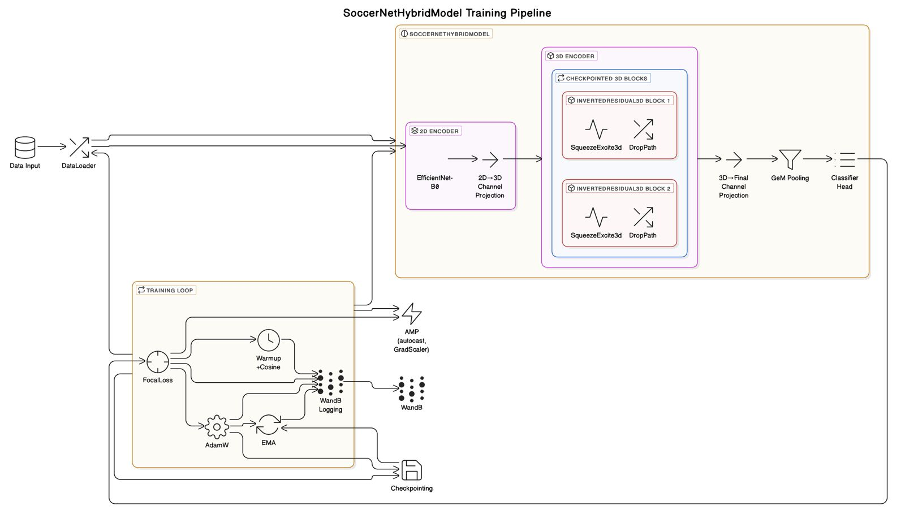
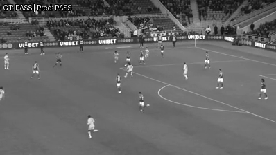

# ⚽ Dribble.AI – Ball Action Tracking in Soccer Videos

Dribble.AI is a deep learning-based system developed for automated ball action spotting in soccer matches. The project leverages the SoccerNet Ball Action Spotting dataset to detect and classify key actions like passes, shots, and goals with high temporal precision. This hybrid architecture combines the spatial strength of CNNs and the temporal modeling capabilities of Transformers to provide real-time, scalable analysis of soccer footage.

---

## 📌 Project Overview

- **Goal:** Accurately localize and classify ball-related actions in soccer videos.
- **Dataset:** [SoccerNet Ball Action Spotting Dataset](https://www.soccer-net.org/tasks/ball-action-spotting)
- **Model:** CNN + Transformer Hybrid Architecture
- **Evaluation Metric:** Mean Average Precision (mAP) at various tolerance levels (as per SoccerNet standards)

---

## 🧠 Architecture 

- **CNN Backbone:** Extracts spatial features from frames (e.g., ResNet, EfficientNet).
- **Temporal Encoder:** Transformer layers capture sequential context for frame-level predictions.
- **Pooling Layer:** Global Average or GeM pooling for feature condensation.
- **Classifier:** Fully connected layers to predict action class probabilities.

---

## 📈 Results 

- **Best mAP@1s**: 0.6658

Model performance is expected to improve further with extended 720p video training, which was not completed due to compute constraints.

--- 

## 👥 Authors
- Shagufta Anjum – MCS, University of Illinois Urbana-Champaign
- Nidhi Baheti – MS Statistics, University of Illinois Urbana-Champaign
- Jyot Buch – MS Statistics, University of Illinois Urbana-Champaign
- Varsha Chikkamagaluru – MCS, University of Illinois Urbana-Champaign
